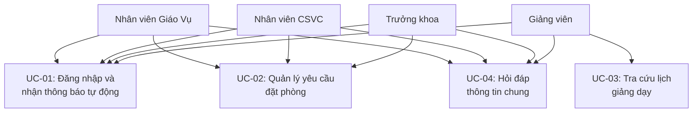
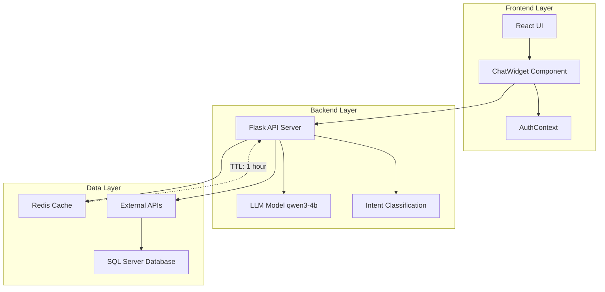
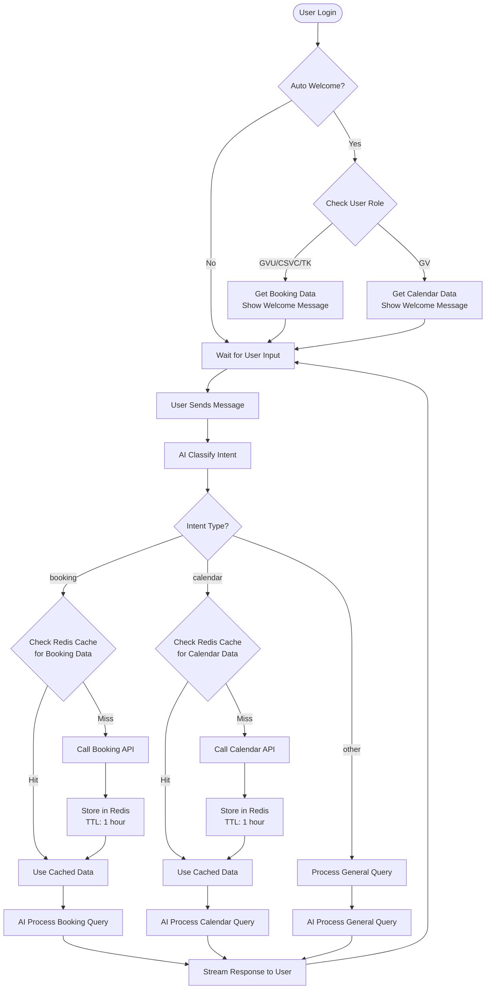
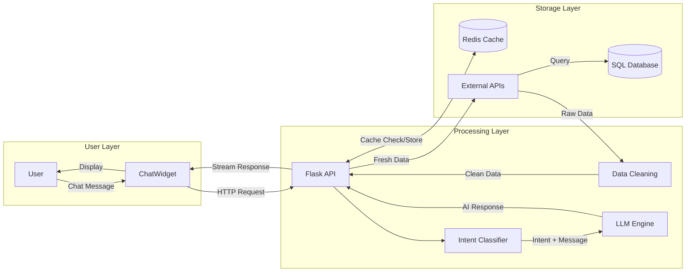
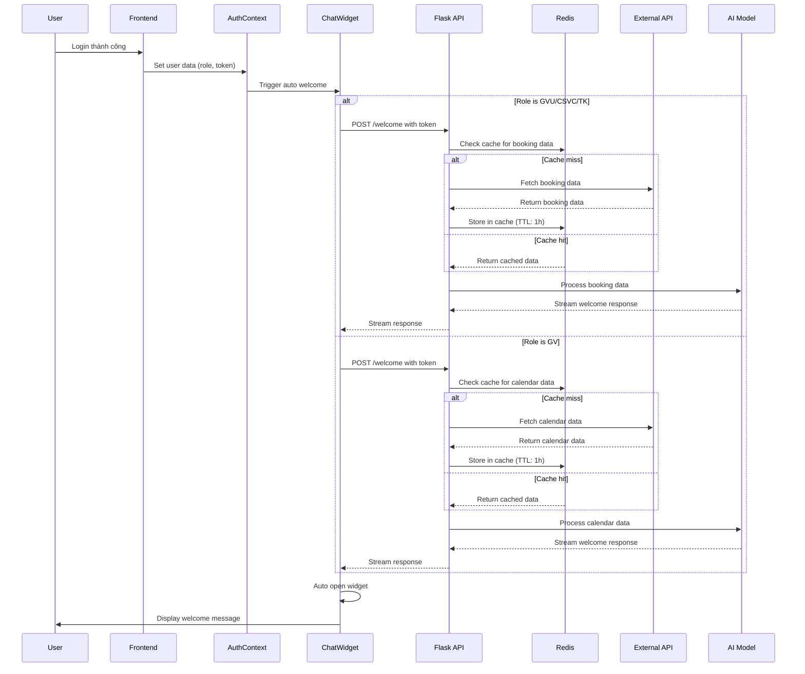
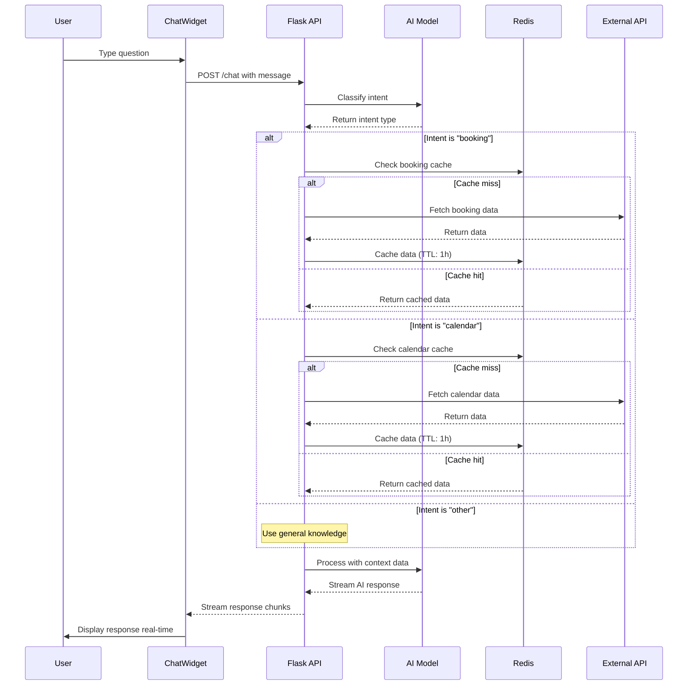

# Báo Cáo Chức Năng AI Chat Widget

## 1. Tổng Quan Hệ Thống

### Mục đích

- Tạo trợ lý AI thông minh hỗ trợ người dùng sử dụng website quản lý phòng máy
- Tự động hiển thị thông tin cần thiết khi đăng nhập
- Trả lời câu hỏi về lịch phòng và yêu cầu đặt phòng

### Các thành phần chính

- **Frontend**: React ChatWidget component
- **Backend**: Python Flask API
- **Cache**: Redis để lưu trữ tạm thời
- **AI**: LLM Model (qwen3-4b) để xử lý ngôn ngữ tự nhiên

## 2. UseCase và System Design

### 2.1 Các UseCase Chính

#### UC-01: Đăng nhập và nhận thông báo tự động

- **Actor**: Tất cả người dùng (GVU, CSVC, TK, GV)
- **Mô tả**: Khi đăng nhập thành công, chatbot tự động mở và hiển thị thông tin quan trọng theo vai trò
- **Pre-condition**: Người dùng đã được xác thực thành công
- **Post-condition**: ChatWidget hiển thị với welcome message phù hợp

#### UC-02: Quản lý yêu cầu đặt phòng (GVU/CSVC/TK)

- **Actor**: Nhân viên Giáo Vụ, Cơ sở vật chất, Trưởng khoa
- **Mô tả**: Xem và quản lý các yêu cầu đặt phòng cần xử lý
- **Triggers**: Chat với câu hỏi về yêu cầu đặt phòng
- **Main Flow**:
  1. User nhập câu hỏi về yêu cầu
  2. AI phân loại intent = "booking"
  3. System lấy dữ liệu từ cache/API
  4. AI xử lý và trả lời với thông tin chi tiết

#### UC-03: Tra cứu lịch giảng dạy (GV)

- **Actor**: Giảng viên
- **Mô tả**: Xem lịch dạy cá nhân và thông tin phòng học
- **Triggers**: Chat với câu hỏi về lịch dạy
- **Main Flow**:
  1. User hỏi về lịch dạy
  2. AI phân loại intent = "calendar"
  3. System lấy dữ liệu lịch từ cache/API
  4. AI trả lời với lịch dạy được lọc theo user

#### UC-04: Hỏi đáp thông tin chung

- **Actor**: Tất cả người dùng
- **Mô tả**: Trả lời các câu hỏi không thuộc category booking/calendar
- **Main Flow**:
  1. User nhập câu hỏi
  2. AI phân loại intent = "other"
  3. AI trả lời dựa trên kiến thức chung
  4. Gợi ý user hỏi về lịch phòng hoặc yêu cầu đặt phòng

### 2.2 Use Case Diagram



### 2.3 System Architecture Diagram



### 2.4 ChatBot Flow Diagram



### 2.5 Data Flow Diagram



### 2.6 Sequence Diagram - Auto Welcome Flow



### 2.7 Sequence Diagram - Chat Interaction Flow



## 3. Phân Loại Người Dùng và Chức Năng

### 3.1 Nhân viên phòng Giáo Vụ (GVU)

**Khi đăng nhập:**

- Tự động hiển thị các yêu cầu đặt phòng cần xử lý HÔM NAY
- Thông báo số lượng yêu cầu đang chờ

**Khi chat:**

- Có thể hỏi về: "yêu cầu nào cần xử lý?", "có bao nhiêu booking hôm nay?"
- AI trả lời dựa trên dữ liệu thực tế từ database

### 3.2 Nhân viên phòng Cơ sở vật chất (CSVC)

**Khi đăng nhập:**

- Tự động hiển thị các yêu cầu đặt phòng cần xử lý HÔM NAY
- Thông báo tình trạng các yêu cầu

**Khi chat:**

- Có thể hỏi về: "yêu cầu mượn phòng nào cần duyệt?"
- AI phân tích và đưa ra thông tin chi tiết

### 3.3 Trưởng khoa (TK)

**Khi đăng nhập:**

- Tự động hiển thị các yêu cầu đặt phòng cần xử lý HÔM NAY
- Tóm tắt tình hình chung

**Khi chat:**

- Có thể hỏi về: "tình hình đặt phòng hôm nay như thế nào?"
- AI đưa ra báo cáo tổng quan

### 3.4 Giảng Viên (GV)

**Khi đăng nhập:**

- Tự động hiển thị lịch dạy HÔM NAY
- Thông báo phòng học, thời gian, môn học

**Khi chat:**

- Có thể hỏi về: "hôm nay tôi dạy ở đâu?", "lịch dạy tuần này?"
- AI trả lời dựa trên lịch giảng dạy cá nhân

## 4. Hệ Thống Cache Redis

### 4.1 Mục đích sử dụng Cache

- **Giảm tải server**: Không cần gọi API liên tục
- **Tăng tốc độ**: Trả lời nhanh hơn cho user
- **Tiết kiệm tài nguyên**: Giảm load database

### 4.2 Quy tắc đặt tên Key

```
Định dạng: api:{endpoint}:{token_hash}[:today]

Ví dụ:
- api:calendarManagement:a1b2c3d4        // Toàn bộ lịch
- api:calendarManagement:a1b2c3d4:today  // Chỉ lịch hôm nay
- api:requestManagement:x9y8z7w6:today   // Chỉ yêu cầu hôm nay
```

### 4.3 Thời gian lưu trữ (TTL)

- **Tất cả cache**: 1 tiếng (3600 giây)
- **Tự động xóa**: Redis tự động xóa khi hết hạn
- **Refresh**: Khi cache hết hạn, gọi API mới và cache lại

### 4.4 Cách hoạt động

1. **Lần đầu**: Gọi API → Lấy dữ liệu → Lưu cache → Trả về user
2. **Lần sau**: Kiểm tra cache → Nếu có → Trả về ngay lập tức
3. **Cache hết hạn**: Gọi API mới → Cập nhật cache → Trả về user

## 5. Quy Trình Xử Lý Dữ Liệu

### 5.1 Làm sạch dữ liệu Calendar (Lịch phòng)

**Dữ liệu gốc từ API:**

```json
{
  "nameSubject": "Hệ quản trị cơ sở dữ liệu",
  "nameTeacher": "Lưu Nguyễn Kì Thư",
  "nameRoom": "1A201",
  "date": "08-04-2025",
  "day": "2",
  "statusCalendar": "ACTIVE"
}
```

**Sau khi làm sạch:**

```json
{
  "Môn học": "Hệ quản trị cơ sở dữ liệu",
  "Giáo viên": "Lưu Nguyễn Kì Thư",
  "Phòng": "1A201",
  "Ngày": "08-04-2025",
  "Thứ": "Thứ 2",
  "Trạng thái": "ACTIVE"
}
```

### 5.2 Làm sạch dữ liệu Booking (Yêu cầu đặt phòng)

**Dữ liệu gốc từ API:**

```json
{
  "requestId": "3",
  "typeRequestName": "Mượn phòng",
  "dateRequest": "30-04-2025 16:08:32",
  "userRequest": "Nguyễn Thị Tuyết Hải",
  "statusName": "Chờ Giáo Vụ xử lý"
}
```

**Sau khi làm sạch:**

```json
{
  "ID yêu cầu": "3",
  "Loại yêu cầu": "Mượn phòng",
  "Ngày yêu cầu": "30-04-2025 16:08:32",
  "Người yêu cầu": "Nguyễn Thị Tuyết Hải",
  "Trạng thái": "Chờ Giáo Vụ xử lý"
}
```

### 5.3 Filter dữ liệu hôm nay

- **Welcome message**: Chỉ lấy dữ liệu có ngày = ngày hiện tại
- **Chat thường**: Lấy toàn bộ dữ liệu để AI có thể trả lời đa dạng
- **Ngày hiện tại**: Theo múi giờ Việt Nam (Asia/Ho_Chi_Minh)

## 6. Cấu Trúc Prompt Gửi Cho AI

### 6.1 Context cơ bản (luôn có)

```
Ngày hiện tại ở Việt Nam: 23-06-2025
Thứ hiện tại ở Việt Nam: Thứ 2
```

### 6.2 Welcome Message cho GVU/CSVC/TK

```
Ngày hiện tại ở Việt Nam: 23-06-2025
Thứ hiện tại ở Việt Nam: Thứ 2

Dữ liệu yêu cầu đặt phòng HÔM NAY cần xử lý: [JSON data]

Hãy tóm tắt các yêu cầu HÔM NAY đang chờ xử lý cho GVU.
Nếu không có yêu cầu nào hôm nay thì thông báo không có việc cần làm hôm nay.

/no_thinking
```

### 6.3 Welcome Message cho GV

```
Ngày hiện tại ở Việt Nam: 23-06-2025
Thứ hiện tại ở Việt Nam: Thứ 2

Dữ liệu lịch dạy HÔM NAY: [JSON data]

Hãy tóm tắt lịch dạy HÔM NAY cho giảng viên.
Nếu không có lịch hôm nay thì thông báo hôm nay không có lịch dạy.

/no_thinking
```

### 6.4 Chat Message thông thường

```
Ngày hiện tại ở Việt Nam: 23-06-2025
Thứ hiện tại ở Việt Nam: Thứ 2
Dữ liệu lịch phòng: [JSON data]

[Câu hỏi của user]

/no_thinking
```

## 7. System Prompt cho AI

### 7.1 Phân loại Intent

```
Bạn là một AI phân loại ý định người dùng.
Các type có thể là:
- 'calendar': hỏi về lịch phòng, lịch thực hành, lịch dạy, môn học
- 'booking': hỏi về yêu cầu đặt phòng, mượn phòng, yêu cầu cần xử lý, phiếu yêu cầu
- 'other': các trường hợp còn lại

Chỉ trả về JSON hợp lệ, không giải thích gì thêm.
```

### 7.2 Trả lời câu hỏi

- **Calendar**: "Bạn là trợ lý quản lý phòng thực hành. Hãy trả lời dựa trên dữ liệu lịch phòng bên dưới..."
- **Booking**: "Bạn là trợ lý quản lý yêu cầu đặt phòng. Hãy trả lời dựa trên dữ liệu yêu cầu bên dưới..."
- **Welcome**: "Bạn là trợ lý thông minh. Hãy chào mừng người dùng và tóm tắt công việc cần làm..."

## 8. Output Structure và Cách Sử Dụng

### 8.1 Streaming Response

- AI trả lời theo dạng **stream** (từng từ một)
- Frontend nhận và hiển thị real-time
- Lọc bỏ `<think>...</think>` tags trước khi hiển thị

### 8.2 Markdown Support

- AI có thể trả lời với **Markdown format**
- Frontend render đẹp với danh sách, bảng, in đậm
- Ví dụ: `**Hôm nay**`, `- Yêu cầu 1`, `## Tóm tắt`

### 8.3 Ví dụ Output thực tế

**Cho GVU:**

```markdown
**Chào mừng bạn đến với hệ thống quản lý phòng máy! 🎯**

## Tóm tắt công việc hôm nay (23-06-2025):

### Yêu cầu cần xử lý:

- **2 yêu cầu** đang chờ Giáo Vụ xử lý:
  1. **Yêu cầu #3**: Mượn phòng - Nguyễn Thị Tuyết Hải
  2. **Yêu cầu #6**: Mượn phòng - Nguyễn Thị Tuyết Hải

### Khuyến nghị:

✅ Ưu tiên xử lý các yêu cầu mượn phòng để đảm bảo lịch học

Bạn có thể hỏi tôi: _"Chi tiết yêu cầu nào cần xử lý?"_
```

**Cho GV:**

```markdown
**Chào mừng thầy/cô! 👨‍🏫**

## Lịch dạy hôm nay (23-06-2025 - Thứ 2):

### Không có lịch dạy hôm nay

🎉 Hôm nay thầy/cô được nghỉ!

### Gợi ý:

- Chuẩn bị bài giảng cho tuần tới
- Kiểm tra lịch dạy tuần này

Bạn có thể hỏi tôi: _"Lịch dạy tuần này như thế nào?"_
```

## 9. Tính Năng Đặc Biệt

### 9.1 Auto-open Chat Widget

- Khi login thành công → Chat widget tự động mở
- Hiển thị welcome message phù hợp với role
- User không cần click gì cả

### 9.2 Smart Caching

- Phân biệt cache cho "toàn bộ dữ liệu" vs "dữ liệu hôm nay"
- Cache key khác nhau để tối ưu performance
- Tự động refresh khi cần thiết

### 9.3 Error Handling

- Nếu API lỗi → Hiển thị message thân thiện
- Nếu không có dữ liệu → AI thông báo "không có việc cần làm"
- Nếu cache lỗi → Fallback về gọi API trực tiếp

## 10. Kết Luận

Hệ thống AI Chat Widget được thiết kế để:

- **Thông minh**: Hiểu ý định user và phân loại câu hỏi
- **Nhanh chóng**: Sử dụng cache để trả lời tức thì
- **Chính xác**: Dựa trên dữ liệu thực tế từ database
- **Thân thiện**: Giao diện đẹp, markdown support
- **Tự động**: Welcome message khi login, auto-open widget

Người dùng chỉ cần đăng nhập và sẽ ngay lập tức nhận được thông tin quan trọng nhất của ngày hôm đó!
